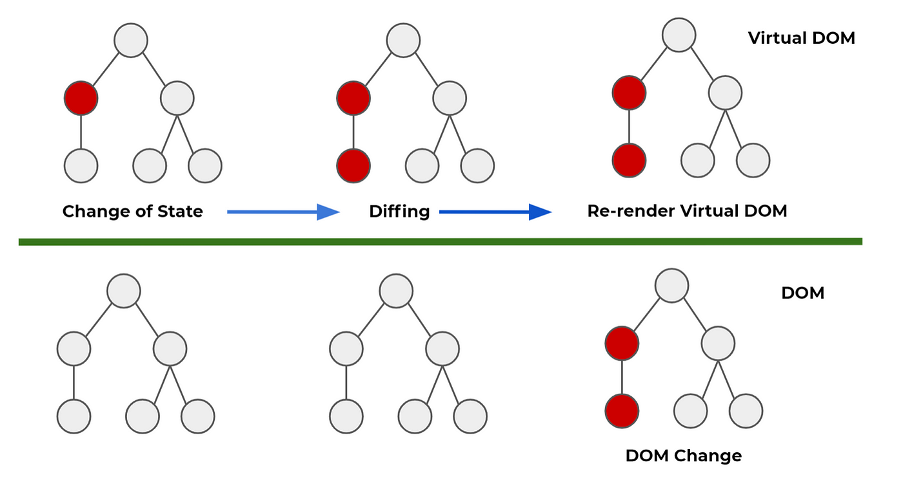
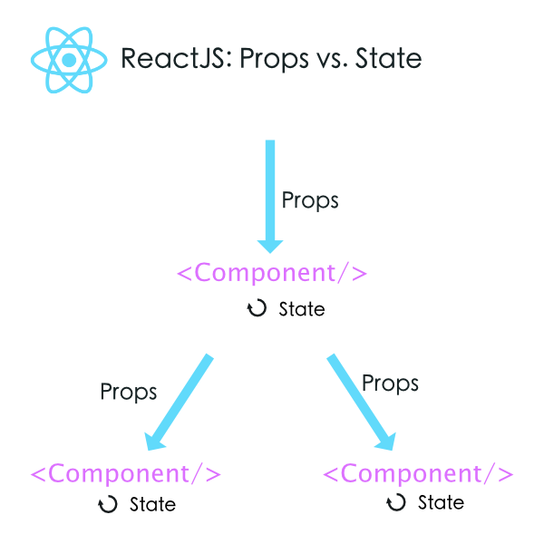

# 김경완 202030403

## 3월 27일 강의 내용

## 3월 20일 강의 내용

### 리액트의 정의
- 사용자 인터페이스를 만들기 위한 자바스크립트 라이브러리

### 리액트 개념 정리
- 복잡한 사이트를 쉽고 빠르게 만들고, 관리하기 위해 만들어진 것이 바로 리액트입니다.
- 다른 표현으로는 SPA를 쉽고 빠르게 만들 수 있도록 해주는 도구라고 생각하면 됩니다.

### 리액트의 장점
#### 1. 빠른 업데이트와 렌더링 속도
- 이 것을 가능하게 하는 것이 바로 Virtual DOM입니다.
- DOM(Document Object Model)이란 XML, HTML 문서의 각 항목을 계층으로 표현하여 생성, 변형, 삭제할 수 있도록 돕는 인터페이스입니다. 이 것은 W3C의 표준입니다.
- Virtual DOM은 DOM 조작이 비효율적인 이유로 속도가 느리기 때문에 고안된 방법입니다.
- DOM은 동기식, Virtual DOM은 비동기식 방법으로 렌더링을 합니다.

#### 2. 컴포넌트 기반 구조
- 리액트의 모든 페이지는 컴포넌트로 구성됩니다.
- 하나의 컴포넌트는 다른 여러 개의 컴포넌트의 조합으로 구성할 수 있습니다.
- 그래서 리액트로 개발을 하다 보면 레고 블록을 조립하는 것처럼 컴포넌트를 조합해서 웹사이트를 개발하게 됩니다.
- 재사용성이 뛰어납니다.

#### 3. 재사용성
- 반복적인 작업을 줄여주기 때문에 생산성을 높여줍니다.
- 또한 유지보수가 용이합니다.
- 재사용이 가능하려면 해당 모듈의 의존성이 없어야 합니다.

#### 4. 든든한 지원군
- 메타(구 페이스북)에서 오픈소스 프로젝트로 관리하고 있어 계속 발전하고 있습니다.

#### 5. 활발한 지식 공유 & 커뮤니티

#### 6. 모바일 앱 개발 가능
- 리액트 네이티브라는 모바일 환경 UI 프레임워크를 사용하면 크로스 플랫폼(cross-platform) 모바일 앱을 개발할 수 있습니다.

### 리액트의 단점
#### 1. 방대한 학습량
- 자바스크립트를 공부한 경우 빠르게 학습할 수 있습니다.

#### 2. 높은 상태 관리 복잡도
- state, component life cycle 등의 개념이 있지만 그리 어렵지 않습니다.

## 3월 13일 강의 내용

### GitHub 사용법
- https://github.com/KennethanCeyer/tutorial-git
