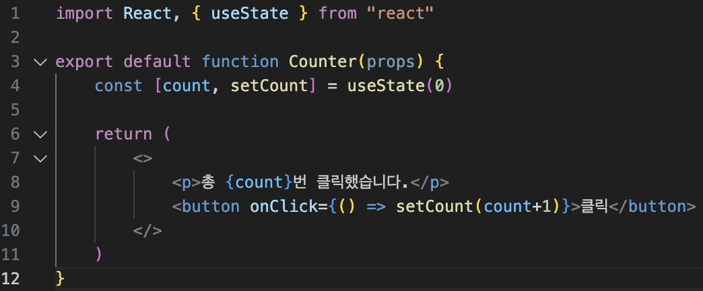
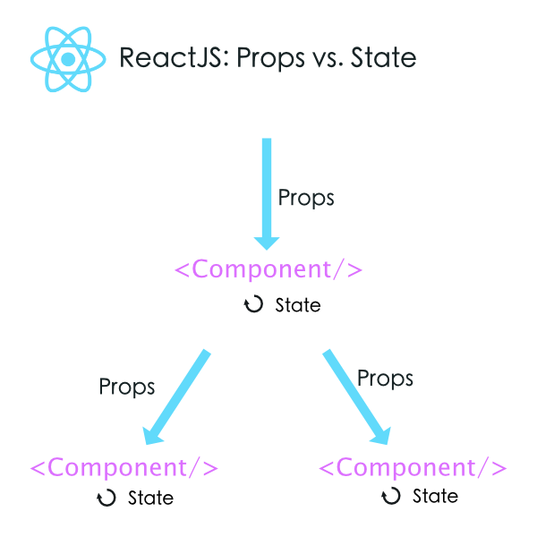

# 김경완 202030403

## 5월 29일 강의 내용
### textarea 태그
- HTML에서는 <textarea>의 children으로 텍스트가 들어가는 형태입니다.
- 리액트에서는 state를 통해 태그의 value라는 attribute를 변경하여 텍스트를 표시합니다.

### select 태그
- select 태그도 textarea와 동일합니다.

### File input 태그
- File input 태그는 그 값이 읽기 전용이기 때문에 리액트에서는 비제어 컴포넌트가 됩니다.

### Input Null Value
- 제어 컴포넌트에 value prop을 정해진 값으로 넣으면 코드를 수정하지 않는 한 입력값을 바꿀 수 없습니다.
- 만약 value prop은 넣되 자유롭게 입력할 수 있게 만들고 싶다면 값이 undefined 또는 null을 넣어주면 됩니다.

## 5월 22일 강의 내용
### 리스트와 키란 무엇인가?
- 리스트는 자바스크립트의 변수나 객체를 하나의 변수로 묶어 놓은 배열과 같은 것입니다.
- 키는 각 객체나 아이템을 구분할 수 있는 고유한 값을 의미합니다.
- 리액트에서는 배열과 키를 사용하는 반복되는 다수의 엘리먼트를 쉽게 렌더링할 수 있습니다.

### 여러 개의 컴포넌트 렌더링하기
- 같은 컴포넌트를 화면에 반복적으로 나타내야 할 경우 배열에 들어있는 엘리먼트를 map() 함수를 이용하여 렌더링합니다.

### 리스트 키에 대해 알아보기
- 리스트에서의 키는 "리스트에서 아이템을 구별하기 위한 고유한 "문자열"입니다.
- 이 키는 리스트에서 어떤 아이템이 변경, 추가 또는 제거되었는지 구분하기 위해 사용합니다.
- 키는 같은 리스트에 있는 엘리먼트 사이에서만 고유한 값이면 됩니다.

### 제어 컴포넌트
- 제어 컴포넌트는 사용자가 입력한 값에 접근하고 제어할 수 있도록 해주는 컴포넌트입니다.

## 5월 8일 강의 내용
### Arguments 전달하기
- 함수를 정의할 때는 파라미터(Parameter) 혹은 매개변수
- 함수를 사용할 때는 아규먼트(Argument) 혹은 인수라고 부릅니다.
- 이벤트 핸들러에 매개변수를 전달해야 하는 경우도 많습니다.

### 엘리먼트 변수
- 렌더링해야 될 컴포넌트를 변수처럼 사용하는 방법이 엘리먼트 변수입니다.

### 인라인 조건
- 필요한 곳에 조건문을 직접 넣어 사용하는 방법입니다.

### 1. 인라인 if
- if문을 직접 사용하지 않고, 동일한 효과를 내기 위해 && 논리 연산자를 사용합니다.
- &&는 and연산자로 모든 조건이 참일때만 참이 됩니다.
- 첫번째 조건이 거짓이면 두번째 조건은 판단할 필요가 없습니다.

### 2. 인라인 if-else
- 삼항 연산자를 사용합니다. 조건문 ? 참일 경우 : 거짓일 경우
- 문자열이나 엘리먼트를 넣어서 사용할 수도 있습니다.

### 컴포넌트 렌더링 막기
- 컴포넌트를 렌더링하고 싶지 않을 때에는 null을 리턴합니다.

## 5월 1일 강의 내용
### 훅의 규칙
#### 훅의 두 가지 규칙
- 첫 번째 규칙은 무조건 최상위 레벨에서만 호출해야 한다는 것입니다.
- 따라서 반복문이나 조건문 또는 중첩된 함수들 안에서 훅을 호출하면 안됩니다.
- 이 규칙에 따라서 훅은 컴포넌트가 렌더링 될 때마다 같은 순서로 호출되어야 합니다.
- 두 번째 규칙은 함수형 컴포넌트에서만 훅을 호출해야 한다는 것입니다.
- 따라서 일반 자바스크립트 함수에서 훅을 호출하면 안됩니다.
- 훅은 함수형 컴포넌트 혹은 직접 만든 커스텀 훅에서만 호출할 수 있습니다.

### 나만의 훅 만들기
- 필요하다면 직접 훅을 만들어 쓸 수도 있습니다. 이것을 커스텀 훅이라고 합니다.

### 커스텀 훅 추출하기
- use로 시작하는 훅을 만들고, 내부에서 다른 훅을 호출하면 됩니다.

### 이벤트 처리하기
- 이벤트가 발생했을 때 해당 이벤트를 처리하는 함수를 "이벤트 핸들러(Event Handler)"라고 합니다. 또는 이벤트가 발생하는 것을 계속 듣고 있다는 의미로 "이벤트 리스너(Event Listener)"라고 부르기도 합니다.

## 4월 17일 강의 내용

### Hook이란 무엇인가?
- 클래스형 컴포넌트에서는 생성자(constructor)에서 state를 정의하고, setState() 함수를 통해 state를 업데이트합니다.
- 예전에 사용하던 함수형 컴포넌트는 별도로 state를 정의하거나, 컴포넌트의 생명주기에 맞춰서 어떤 코드가 실행되도록 할 수 있습니다.
- 함수형 컴포넌트에서도 state나 생명주기 함수의 기능을 사용하게 해주기 위해 추가된 기능이 바로 훅(Hook)입니다.
- 함수형 컴포넌트도 훅을 사용하여 클래스형 컴포넌트의 기능을 모두 동일하게 구현할 수 있게 되었습니다.
- 훅이란 'state와 생명주기 기능에 갈고리를 걸어 원하는 시점에 정해진 함수를 실행되도록 만든 함수'를 의미합니다.
- 훅의 이름은 모두 'use'로 시작합니다.
- 사용자 정의 훅(custom hook)을 만들 수 있으며, 이 경우에 이름은 자유롭게 할 수 있으나 'use'로 시작할 것을 권장합니다.

### useState
- useState는 함수형 컴포넌트에서 state를 사용하기 위한 Hook입니다.

### useEffect
- useState와 함께 가장 많이 사용하는 Hook입니다.
- 이 함수는 사이드 이펙트를 수행하기 위한 것입니다.
- 영어로 side effect는 부작용을 의미합니다. 일반적으로 프로그래밍에서 사이트 이펙트는 '개발자가 의도하지 않은 코드가 실행되면서 버그가 발생하는 것'을 말합니다.
- 하지만 리액트에서는 효과 또는 영향을 뜻하는 effect의 의미에 가깝습니다.
- 예를 들면 서버에서 데이터를 받아오거나 수동으로 DOM을 변경하는 등의 작업을 의미합니다.
- 이 작업을 이펙트라고 부르는 이유은 이 작업들이 다른 컴포넌트에 영향을 미칠 수 있으며, 렌더링 중에는 작업이 완료될 수 없기 때문입니다. 렌더링이 끝난 이후에 실행되어야 하는 작업들입니다.
- 클래스 컴포넌트의 생명주기 함수와 같은 기능을 하나로 통합한 기능을 제공합니다.
- sideEffect는 렌더링 외에 실행해야 하는 부수적인 코드를 말합니다.
- 예를 들면 네트워크 리퀘스트, DOM 수동 조작, 로깅 등은 정리(clean-up)가 필요 없는 경우들입니다.
- useEffect() 함수는 다음과 같이 사용합니다.
- 첫 번째 파라미터는 이펙트 함수가 들어가고, 두 번째 파라미터로는 의존성 배열이 들어갑니다.
- 의존성 배열은 이펙트가 의존하고 있는 배열로, 배열 안에 있는 변수 중에 하나라도 값이 변경되었을 때 이펙트 함수가 실행됩니다.
- 이펙트 함수는 처음 컴포넌트가 렌더링 된 이후, 그리고 재 렌더링 이후에 실행됩니다.
- 만약 이펙트 함수가 마운트와 언마운트 될 때만 한 번씩 실행되게 하고 싶으면 빈 배열을 넣으면 됩니다. 이 경우 props나 state에 있는 어떤 값에도 의존하지 않기 때문에 여러번 실행되지 않습니다.

### useMemo
- useMemo() 혹은 Memoizde value를 리턴하는 훅입니다.
- 이전 계산값을 갖고 있기 때문에 연산량이 많은 작업의 반복을 피할 수 있습니다.
- 이 훅은 렌더링이 일어나는 동안 실행됩니다.
- 따라서 렌더링이 일어나는 동안 실행돼서는 안될 작업을 넣으면 안됩니다.
- 예를 들면 useEffect에서 실행되어야 할 사이드 이펙트 같은 것입니다.
- 의존성 배열을 넣지 않을 경우, 렌더링이 일어날 때마다 매번 함수가 실행됩니다.
- 따라서 의존성 배열을 넣지 않는 것은 의미가 없습니다.
- 만약 빈 배열을 넣게 되면 컴포넌트 마운트 시에만 함수가 실행됩니다.

### useCallback
- useCallback() 혹은 useMemo()와 유사한 역할을 합니다.
- 차이점은 값이 아닌 함수를 반환한다는 점입니다.
- 의존성 배열을 파라미터로 받는 것은 useMemo와 동일합니다.
- 파라미터로 받은 함수를 콜백이라고 부릅니다.
- useMemo와 마찬가지로 의존성 배열 중 하나라도 변경되면 콜백 함수를 반환합니다.

### useRef
- useRef() 혹은 레퍼런스를 사용허기 위한 훅입니다.
- 레퍼런스란 특정 컴포넌트에 접근할 수있는 객체를 의미합니다.
- useRef() 혹은 바로 이 레퍼런스 객체를 반환합니다.
- 레퍼런스 객체에는 .current라는 속성이 있는데, 이것은 현재 참조하고 있는 엘리먼트를 의미합니다.
- 반환된 레퍼런스 객체는 컴포넌트의 라이프타임 전체에 걸쳐서 유지됩니다.
- 즉, 컴포넌트가 마운트 해제 전까지는 계속 유지된다는 의미입니다.

### Hook의 규칙
- 첫 번째 규칙은 무조건 최상의 레벨에서만 호출해야 한다는 것입니다. 여기서 최상위는 컴포넌트의 최상위 레벨을 의미합니다.
- 따라서 반복문이나 조건문 또는 중첩된 함수들 안에서 훅을 호출하면 안됩니다.
- 이 규칙에 따라서 훅은 컴포넌트가 렌더링 될 때마다 같은 순서로 호출되어야 합니다.

## 4월 3일 강의 내용

### 컴포넌트에 대해 알아보기
- 리액트는 컴포넌트 기반의 구조를 갖습니다.
- 컴포넌트 구조라는 것은 작은 컴포넌트가 모여 큰 컴포넌트를 구성하고, 다시 이런 컴포넌트들이 모여서 전체 페이지를 구성한다는 것을 의미합니다.

### props에 대해 알아보기
#### 1. props의 개념
- props는 prop(property : 속성, 특성)의 준말입니다.
- 이 props가 바로 컴포넌트의 속성입니다.
- 컴포넌트에 어떤 속성, props를 넣느냐에 따라서 속성이 다른 엘리먼트가 출력됩니다.
- props는 컴포넌트에 전달할 다양한 정보를 담고있는 자바스크립트 객체입니다.

#### 2. props의 특징
- 읽기 전용입니다. 변경할 수 없다는 의미입니다.
- 속성이 다른 엘리먼트를 생성하면 새로운 props를 컴포넌트에 전달하면 됩니다.

#### Pure 함수 vs Impure 함수
- Pure 함수는 인수로 받은 정보가 함수 내부에서도 변하지 않는 함수입니다.
- Impure 함수는 인수로 받은 정보가 함수 내부에서 변하는 함수입니다.

#### 3. props 사용법
- JSX에서는 key-value쌍으로 props를 구성합니다.
- JSX에서는 중괄호를 사용하면 JS코드를 넣을 수 있습니다.
- props를 통해서 value를 할당할 수도 있고, 직접 중괄호를 사용하여 할당할 수도 있습니다.
- JSX를 사용하지 않는 경우 props의 전달 방법은 createElement()함수를 사용하는 것입니다.
- createElement()함수의 두번째 매개변수가 바로 props입니다.

### 컴포넌트 만들기
#### 1. 컴포넌트의 종류
- 리액트 초기 버전을 사용할 때는 클래스형 컴포넌트를 주로 사용했습니다.
- 이후 Hook이라는 개념이 나오면서 최근에는 함수형 컴포넌트를 주로 사용합니다.
- 예전에 작성된 코드나 문서들이 클래스형 컴포넌트를 사용하고 있기 때문에, 클래스형 컴포넌트와 컴포넌트의 생명주기에 관해서도 공부해두어야 합니다.

#### 2. 함수형 컴포넌트

#### 3. 클래스형 컴포넌트

#### 4. 컴포넌트 이름 짓기
- 이름은 항상 대문자로 시작합니다.
- 리액트는 소문자로 시작하는 컴포넌트를 DOM 태그로 인식하기 때문입니다. html tag.
- 컴포넌트 파일 이름과 컴포넌트 이름은 같게 합니다.

### 컴포넌트 합성
- 컴포넌트 합성은 여러 개의 컴포넌트를 합쳐서 하나의 컴포넌트를 만드는 것입니다.
- 리액트에서는 컴포넌트 안에 또 다른 컴포넌트를 사용할 수 있기 때문에, 복잡한 화면을 여러 개의 컴포넌트로 나누어 구현할 수 있습니다.

### 컴포넌트 추출
- 복잡한 컴포넌트를 쪼개서 여러 개의 컴포넌트로 나눌 수도 있습니다.
- 큰 컴포넌트에서 일부를 추출해서 새로운 컴포넌트를 만드는 것입니다.
- 실무에서는 처음부터 1개의 컴포넌트에 하나의 기능만 사용하도록 설계하는 것이 좋습니다.

### state
#### 1. state란?
- state는 리액트 컴포넌트의 상태를 의미합니다.
- 상태의 의미는 정상인지 비정상인지가 아니라 컴포넌트의 데이터를 의미합니다.
- 정확히는 컴포넌트의 변경가능한 데이터를 의미합니다.
- state가 변하면 다시 렌더링이 되기 때문에 렌더링과 관련된 값을 state에 포함시켜야 합니다.

#### 2. 특징
- 리액트만의 특별한 형태가 아닌 단지 자바스크립트 객체일 뿐입니다.
- state는 변경은 가능하다고 했지만 직접 수정해서는 안됩니다.
- 불가능하다고 생각하는 것이 좋습니다.
- state를 변경하고자 할 때는 setstate() 함수를 사용합니다.

### 생명주기에 대해 알아보기
- 생명주기는 컴포넌트의 생성 시점, 사용 시점, 종료 시점을 나타내는 것입니다.
- constructor가 실행되면서 컴포넌트가 생성됩니다.
- 생성 직후 componentDidMount() 함수가 호출됩니다.
- 렌더링은 props, setstate(), forceUpdate()에 의해 상태가 변경되면 이루어집니다.
- 그리고 렌더링이 끝나면 componentDidUpdate() 함수가 호출됩니다.
- 마지막으로 컴포넌트가 Unmount되면 componentWillUnmount() 함수가 호출됩니다.

## 3월 27일 강의 내용

### JSX(JavaScript XML)란?
- JavaScript에 XML을 추가한 확장 문법입니다.

### JSX의 역할
- JSX는 내부적으로 XML/HTML 코드를 자바스크립트로 변환합니다.
- React가 createElement 함수를 사용하여 자동으로 자바스크립트로 변환해줍니다.
- 만일 JS 작업할 경우 직접 createElement 함수를 사용해야합니다.
- 앞으로 설명하는 코드를 보면 알 수 있지만 결국 JSX는 가독성을 높여주는 역할을 합니다.

### JSX의 장점
- 코드가 간결해집니다.
- 가독성이 향상됩니다.
- Injection Attack이라 불리는 해킹 방법을 방어함으로써 보안에 강합니다.

### JSX 사용법
- 모든 자바스크립트 문법을 지원합니다.
- 자바스크립트 문법에 XML과 HTML을 섞어서 사용합니다.
- 만일 HTML이나 XML에 자바스크립트 코드를 사용하고 싶으면 {}괄호를 사용합니다.

### 엘리먼트에 대해 알아보기
#### 1. 엘리먼트의 정의
- 엘리먼트는 리액트 앱을 구성하는 요소를 의미합니다.
- 공식페이지에는 "엘리먼트는 리액트 앱의 가장 작은 빌딩 블록들"이라고 설명하고 있습니다.
- 웹사이트의 경우는 DOM 엘리먼트이며 HTML요소를 의미합니다.

#### 리액트 엘리먼트와 DOM 엘리먼트는 어떤 차이가 있을까요?
- 리액트 엘리먼트는 Virtual DOM의 형태를 취하고 있습니다.
- DOM 엘리먼트는 페이지의 모든 정보를 갖고 있어 무겁습니다.
- 반면 리액트 엘리먼트는 변화한 부분만 갖고 있어 가볍습니다.

#### 2. 엘리먼트의 생김새
- 리액트 엘리먼트는 자바스크립트 객체의 형태로 존재합니다.
- 컴포넌트(Button 등), 속성(color 등) 및 내부의 모든 children을 포함하는 일반 JS 객체입니다.
- 이 객체는 마음대로 변경할 수 없는 불변성을 갖고 있습니다.

#### 3. 엘리먼트의 특징
- 리액트 엘리먼트의 가장 큰 특징은 불변성입니다.
- 즉, 한 번 생성된 엘리먼트의 children이나 속성(attributes)을 바꿀 수 없습니다.
#### 만일 내용이 바뀌면 어떻게 해야 할까요?
- 이 때는 컴포넌트를 통해 새로운 엘리먼트를 생성하면 됩니다.
- 그 다음 이전 엘리먼트와 교체를 하는 방법으로 내용을 바꾸는 것입니다.
- 이렇게 교체하는 작업을 하기위해 Virtual DOM을 사용합니다.

### 엘리먼트 렌더링하기
- Root DOM node
- 다음 HTML 코드는 id값이 root인 div태그로 단순하지만 리액트에 필수로 들어가는 아주 중요한 코드입니다.
- 이 div태그 안에 리액트 엘리먼트가 렌더링 되며, 이 것을 Root DOM node라고 합니다.
- 엘리먼트를 렌더링하기 위해서는 다음과 같은 코드가 필요합니다.
- 이 때 render() 함수를 사용하게 됩니다.
- 이 함수의 첫 번째 파라메터 출력할 리액트 엘리먼트이고, 두 번째 파라메터는 출력할 타겟을 나타냅니다.
- 즉 리액트 렌더링의 과정은 Virtual DOM에서 실제 DOM으로 이동하는 과정이라고 할 수 있습니다.

### 렌더링된 엘리먼트 업데이트하기
- 다음 코드는 tick() 함수를 정의하고 있습니다.
- 이 함수는 현재 시간을 포함한 element를 생성해서 root div에 렌더링 해줍니다.
- 그런데 라인12에 보면 setInterval() 함수를 이용해서 위에서 정의한 tick()을 1초에 한번씩 호출하고 있습니다.
- 결국 1초에 한번씩 element를 새로 만들고 그것을 교체하는 것입니다.
- 다음 코드를 실행하고, 크롬 개발자 도구에서 확인해보면 시간 부분만 업데이트 되는 것을 확인할 수 있습니다.

## 3월 20일 강의 내용

### 리액트의 정의
- 사용자 인터페이스를 만들기 위한 자바스크립트 라이브러리

### 리액트 개념 정리
- 복잡한 사이트를 쉽고 빠르게 만들고, 관리하기 위해 만들어진 것이 바로 리액트입니다.
- 다른 표현으로는 SPA를 쉽고 빠르게 만들 수 있도록 해주는 도구라고 생각하면 됩니다.

### 리액트의 장점
#### 1. 빠른 업데이트와 렌더링 속도
- 이 것을 가능하게 하는 것이 바로 Virtual DOM입니다.
- DOM(Document Object Model)이란 XML, HTML 문서의 각 항목을 계층으로 표현하여 생성, 변형, 삭제할 수 있도록 돕는 인터페이스입니다. 이 것은 W3C의 표준입니다.
- Virtual DOM은 DOM 조작이 비효율적인 이유로 속도가 느리기 때문에 고안된 방법입니다.
- DOM은 동기식, Virtual DOM은 비동기식 방법으로 렌더링을 합니다.

#### 2. 컴포넌트 기반 구조
- 리액트의 모든 페이지는 컴포넌트로 구성됩니다.
- 하나의 컴포넌트는 다른 여러 개의 컴포넌트의 조합으로 구성할 수 있습니다.
- 그래서 리액트로 개발을 하다 보면 레고 블록을 조립하는 것처럼 컴포넌트를 조합해서 웹사이트를 개발하게 됩니다.
- 재사용성이 뛰어납니다.

#### 3. 재사용성
- 반복적인 작업을 줄여주기 때문에 생산성을 높여줍니다.
- 유지보수가 용이합니다.
- 재사용이 가능하려면 해당 모듈의 의존성이 없어야 합니다.

#### 4. 든든한 지원군
- 메타(구 페이스북)에서 오픈소스 프로젝트로 관리하고 있어 계속 발전하고 있습니다.

#### 5. 활발한 지식 공유 & 커뮤니티

#### 6. 모바일 앱 개발 가능
- 리액트 네이티브라는 모바일 환경 UI 프레임워크를 사용하면 크로스 플랫폼(cross-platform) 모바일 앱을 개발할 수 있습니다.

### 리액트의 단점
#### 1. 방대한 학습량
- 자바스크립트를 공부한 경우 빠르게 학습할 수 있습니다.

#### 2. 높은 상태 관리 복잡도
- state, component life cycle 등의 개념이 있지만 그리 어렵지 않습니다.

## 3월 13일 강의 내용

### GitHub 사용법
- https://github.com/KennethanCeyer/tutorial-git

### 깃을 왜 사용하죠?
- 빠른 협업환경 조성
- 누가, 언제, 무엇을, 왜, 어떻게 수정했는지 코드리뷰가 가능.
- 이슈트래커 (Issue Tracker) 지원.
- 깃헙 (GitHub)을 이용하여 자신의 git을 쉽게 공유 가능.
- 지속적인 통합 (Continuous Integration) 지원.
- Visual Studio, Jetbrains IntelliJ, Android Studio 등 대부분의 IDE에서 git 연동 제공.

### 깃이 어떤 역할을 하는건가요?
- 소스 병합 (merge, rebase)
- 소스 리비전 관리 (reset, commit, branch)
- 소스 릴리즈 (push)
- 소스 태깅 (tag)
- 소스 변경사항 검토 (diff, log)

### 깃은 어디에서 지원하나요?
- 윈도우즈 (Windows)
- 맥 (OS X)
- 리눅스 (Ubuntu, CentOS, Redhat, Debian, etc)
- 유닉스 (FreeBSD, Solaris, etc)